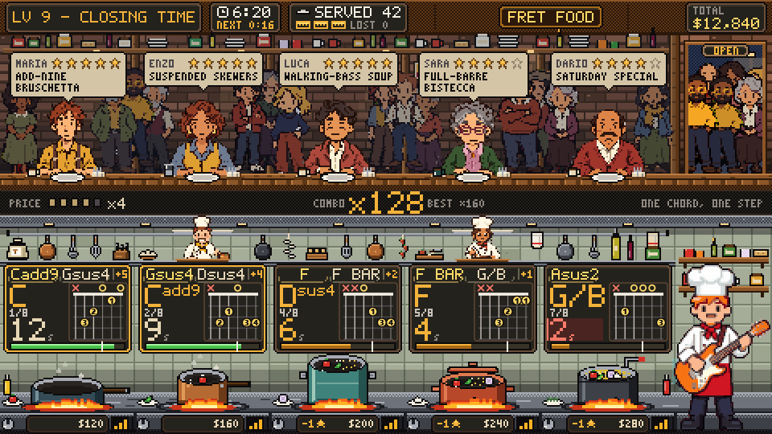
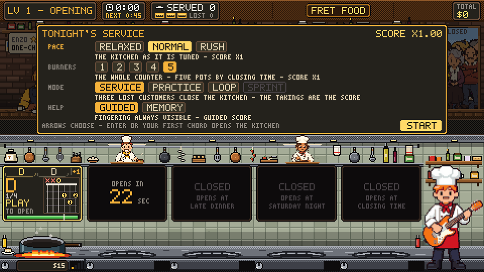
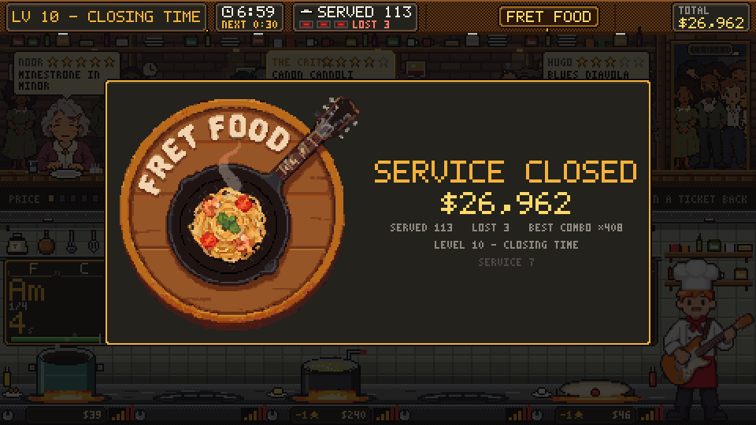

# Fret Food

A chord-change arcade game for
[fee[dB]ack](https://github.com/got-feedback), built on the Minigames SDK.

Chord changes are the wall every beginner hits, and the standard way to
practise them is a metronome and a timer: play C, play G, count how many you
managed in a minute. It works and nobody does it, because there is nothing to
find out. Fret Food makes the same drill into a service at a kitchen counter.

Every customer orders a **dish**, and a dish is a chord progression.
Three-Chord Margherita is C F G. Two-Five-One Risotto is Dm G C. One-Chord
Toast is C, four times over, and it is the first thing anybody plays. Every
name carries the progression it is made of, so the menu teaches while it sells.

**Play the chord the ticket wants and that step is cooked.** One chord heard is
one step, at once, and the card turns over to the next one. There is nothing to
count and no rhythm to guess — which is not a simplification, it is the only
thing the microphone can actually measure. (The onset detector re-arms every
180 ms whether the string has stopped ringing or not, so one slow sweep across
six strings arrives as three or four strums; `src/engine.js` has the long
version of why that killed every rule built on counting.)

What makes it hard is the **clock**, and three things follow from it:

- **The pot is the clock.** Cooking a step fills it, and it drains at the
  burner's rate. Above the line the next step comes out clean; under it the
  step still cooks and the dish is spoiled — a star, and the tip. At zero the
  customer leaves, and three lost customers close the service. Nothing you play
  correctly ever does nothing.
- **A harder change is given more room.** Every finger that has to move buys
  time before a step counts as late, so C to F gets four seconds where C to Am
  gets two and a half. The drill measures the hand and not the fingering.
- **One chord feeds every pot that wants it.** When two orders sit on the same
  step, playing it once cooks both, and both cards say `2 POTS` so you can see
  the play coming. That is the only greedy decision in the game, and it is
  where the points are.

Money is the score. A dish pays its price times your chain, plus a 25% tip if
it left the pot without a single dirty strum.



*Closing Time, four pots. Every card is a ticket and a fingering, every pot a
clock, two of them want the same B flat, and the bell has just paid a perfect
service.*

**Status: alpha.** Built and verified against the fee[dB]ack desktop build
with a guitar; the balance is measured by an automatic player rather than
felt. Only the guitar scores: the keyboard and the scripted player exist for
development and report nothing to the hub.

---

## What it practises, honestly

The dish list is built from real chord shapes, and every price is computed from
the fingers that actually move between the shapes in the recipe, not chosen by
hand. One-Finger Crostini (C, Am) pays $8 because it is one finger.
Three-Chord Margherita (C, F, G) pays $26 because it is seven, and one of them
is F.

Difficulty climbs on two axes and they are deliberately separate. Recipes get
LONGER — two steps at the opening, eight by Saturday night. And the shapes get
HARDER: open position first, then the partial F, then the sevenths, then a
first barre at the first fret, then full barres, and last the same barres moved
up to the fourth and sixth frets, where the diagram stops drawing a nut and
starts printing the fret it begins at. A four-chord dish of C Am F G is long; a
three-chord dish of Bb F C is hard, and until the shapes had a level of their
own the game had no way to say so.

The shapes come first, and the pans after. The whole ladder of shapes is
climbed on the opening's two pans, one tier a service — the partial F at Lunch,
the sevenths at Lunch Rush, the first barre at Afternoon, the full barres at
Happy Hour, the neck at Dinner — and only then does the counter grow, one place
a service: three pans at Late Dinner, four on Saturday Night, five at Closing
Time. Nine services of a minute each. This is a chord-change drill, and what a
novice has to get good at is the changes: a third pot before the neck is done
teaches juggling instead. The second pan stays through the ladder because two
pots wanting one chord is the one greedy play, and because a round trip has to
exist for the clock to mean anything.

Whoever wants fewer pans than that has the options plate: **Burners** caps
the counter at one to five places for the whole service, and the flames still
climb. One pan is the drill with nothing else on the screen.

**The kitchen cools when the menu changes.** The flames climb from the first
bell to the last, so the hardest shapes used to arrive at the tightest clock
in the game: a pot lived twelve and a half seconds at the Opening and four by
Closing Time, and the barres were dealt at six while C to Am had twelve. That
is the difficulty curve upside down, and a session said so — *I lose before I
have played all the chords*. So a bell that unlocks a TIER OF SHAPES takes the
burner back down instead of pushing it up, and a bell that opens a PLACE
climbs as it always did:

| bell            | 1    | 2    | 3    | 4    | 5   | 6   | 7   | 8   | 9   |
|-----------------|-----:|-----:|-----:|----:|----:|----:|----:|----:|----:|
| before          | 12.6 |  9.6 |  7.5 | 6.2 | 5.2 | 4.4 | 3.8 | 3.4 | 3.0 |
| now             | 12.6 | 11.6 | 10.8 |10.0 | 9.4 | 8.8 | 6.7 | 5.4 | 4.5 |

Seconds a pot lives; the first six bells are the tiers of shapes and the last
three are the pans. A new shape is met with about as much time as the last new
shape had, and the pressure comes back when the counter grows — which is the
round trip, not the hand. Measured: a slow hand on two pots lasted four to
seven minutes and now lasts eight to nine.

**How long you actually get, per dish.** The number on a card is seconds, and
this is what it says when a customer sits down, averaged over a service at the
normal pace:

| level   | 1    | 2    | 3   | 4   | 5   | 6   | 7   | 8   | 9   |
|---------|-----:|-----:|----:|----:|----:|----:|----:|----:|----:|
| seconds | 11.4 | 10.6 | 9.8 | 9.3 | 8.7 | 8.2 | 6.2 | 5.2 | 4.5 |

Relaxed is a third more, rush a fifth less. Inside a level the drift is small:
the first customer of the opening gets 12.6 s and the nineteenth 10.4.

**Reading a card is not idling.** Past five beats with no strum the pots go
down half as fast again, which is there to stop a player standing still. It
used to be three beats at DOUBLE, and measured from the player's chair that
was brutal in a way nothing on the screen explained: the card shows the
seconds at the current rate, so at 2.25 s the number being read halved and
then fell twice as fast. On relaxed a fresh pot went 16.2, 14.2, then 6.9 and
5.4 — and a pot promising sixteen seconds really lasted nine. Four seconds is
reading a new card and putting a hand on the neck, which is what a beginner
does at the start of every dish. So the rule bites later and gentler, and a
pot the hand has **never fed** is not on that clock at all: a customer who has
just sat down goes down at their own rate until you have answered them once.
The card and the customer now agree — it says 16.2 and they leave at 16.0.

**The plates on sticks.** With two pots or more the round trip is what kills:
cook one pot cleanly and the others cool the whole while, so a player who plays
one ticket well loses the rest. So every step cooked hands the OTHER pots a
fifth of a full pot between them — two pots, the whole fifth every time; five,
a twentieth each. Enough that a player who plays in turn keeps them all, not so
much that camping on one saves the rest: a fifth is a fifth, not a reset.
Handed whole to each pot instead of split, the automatic player never lost a
customer in ten minutes, and a service has to be able to end.

**Every open chord from the first tier, and drills.** Em and D sat at the third
and fourth tiers with the sevenths and the first barre, E and A at the third,
so a player who knew every open chord met none of them until minute three and
every service opened on C and G. The six open shapes with two or three fingers
are the first tier now — C, Am, G, Dm, Em, D — and A, E and the partial F the
second. And half the invented dishes at every tier are drills: two or three
shapes of that tier in a random order, named for their changes (E-to-A
Frittata, D-G-D Skewers), because this is a drill of changes and a change does
not need a harmony to be worth practising.

**Nine more shapes for the changes themselves.** Cadd9, Gsus4, Dsus4, Asus2,
Asus4 and G/B are the small movements a hand practises between the chords it
already knows — Cadd9 shares three fingers with G, Dsus4 is D with one finger
more, G/B is the bass stepping from G down to C — and they sit in the first
two tiers beside the shapes they belong to. B and G#m finish the keys of E and
A up the neck. And F has two fingerings: the small one at the second tier and
the whole barre at the fourth, written F on the card like the other and told
apart by its diagram, which is what a diagram is for. Five dishes are written
on them — Suspended Toast, Add-Nine Bruschetta, Suspended Skewers,
Walking-Bass Focaccia, Full-Barre Bistecca — and the drills draw them like
any other shape of their tier.

Every recipe has its own pan and its own ingredients, and there is one
ingredient per step. Cook a step and the next one goes in, so the pan fills as
the progression advances: a stockpot of minestrone and a pizza stone read as
different jobs from across the counter, and a glance at either says how far
that order has come without reading a word. It is the mechanic, drawn, rather
than decoration laid on top of it.

A change that is both far and rushed comes out dirty: it leaves soot, soot
makes the pot cool faster, and soot costs you the tip. That is not a penalty
invented for the game, it is what the chord detector hears when you jump onto a
shape without giving your hand the beat to get there.

---

## The screen

Each station shows the order ticket, the recipe as a row of chips with the one
you owe right now lit, a heat bar with a fixed tick at the line you have to
clear, the pot, and its flame. The only number on a station is how many seconds
that pot has left, because "dies in 6" is a decision and "35%" is not. Under
the pan, on the stove front, the stars and what the dish pays if it goes out
now — price times multiplier, plus the tip while the pot is clean — in gold,
which is the one colour money has on this screen.

A chip too narrow for its chord's whole name — `Cadd9` in a chip cut for `Am`
— prints the root and takes a **cyan rule** under it: the letter is not the
whole chord, and the big name and the fingering on the card are. Without that
mark the preview showed a C where a Cadd9 was coming, which is worse than
showing nothing: the hand goes to the shape it read.

On the right of every ticket is the fingering for the chord that ticket owes:
six strings, four fret spaces, a numbered dot per finger, `o` and `x` over the
open and muted strings, one bar where one finger lies across the neck, and the
fret number instead of a nut when the shape sits further up.

It is the one panel of this game that is **not pixels**. Everything else is
drawn into a 480×270 buffer and blown up, because that is what makes it a game
and not a form; the diagram is drawn as SVG on a layer over the canvas, in the
same coordinate system, and rendered at the real resolution of the screen. A
fingering is not scenery, it is the instruction, and at three pixels a digit the
instruction was a smudge — a bigger pixel diagram was just a bigger smudge.

`node tools/chordsheet.mjs > docs/chords.svg` writes every shape in the game on
one sheet, drawn by the same code, grouped by the level it is unlocked at.

The strip under the dining room carries the price multiplier, the combo and
one line the game uses to speak: the rule while it is new, `SILENCE - THE POTS
COOL TWICE AS FAST` when you stop playing (they do: it is the one rule nothing
else on the screen shows), the keys when the keyboard is what is talking, and
a plain word when the window is too small to read a fingering in.

---

## Opening, pausing, closing

**The kitchen opens at the first chord.** The first customer sits down and
waits, the card says `PLAY` where the seconds will be, and the sign over the
door says `CLOSED`; nothing cools and no clock runs until you play. The first ticket is a
dish with no change in it and the second has one change, so the first minute
teaches the rule before it tests you on it. In a first service three short
notices say what just happened the first time it happens: a step cooked, a step
under the line, one chord feeding two pots. They are never said again.

**`P` pauses.** So does the window losing focus. The hub's Quit button holds the
service and asks; a second click closes it and the takings are recorded, not a
zero.

**A pace and a counter are chosen before the service**, on the options plate
below: relaxed, normal or rush, and one to five burners. The pace moves two
numbers — how fast a pot drains and how fast the flames climb — and nothing
else, so the line, the grace per finger and the prices are the same game at
every pace.

**A lost customer can be won back.** Three lost and the service closes, but
eight dishes served clean in a row — with the tip, not a star lost on any of
them — bring one back, and the ticket lights up again on the bar. The strip
counts them down while somebody is lost. A dish that lost a star breaks the
run, and so does losing somebody else.

**A perfect service pays.** A level that ends with something served and nobody
lost adds a quarter of its takings, and the bell says so in gold.

**The critic.** From the second service on, now and then, a customer with a
gold-edged bubble orders the hardest dish the counter can ask for and pays
three times for it. Losing them is a strike like any other. They start visiting
once the hub has counted 300 dB across its games; the sprint opens at 1000 and
the signature menu, nine invented dishes a tier instead of six, at 2500.



**The options plate.** The pace, the burners and the mode are chosen in the
game, on a plate over the dining room, while the first customer already sits
with their ticket up. Every value has a sentence under it that says what it
does to the kitchen and what it does to the score, the plate adds the
multiplier up, and a sprint not yet earned can be read but not taken. Arrows
and Enter, a click on a chip or on START, or the first chord — which closes
the plate and opens the kitchen in one gesture. The choice is kept for next
time; `?fretfood_pace=`, `?fretfood_pans=` and `?fretfood_mode=` preselect
it. The hub's own picker asks nothing any more — the manifest declares no
modifiers — and since the hub reads the manifest at startup, a host that was
already running shows the old rows until it restarts.

**Modes.** The plate's third row: *practice* never closes and writes the time
of every change over the card it cooked, green in time and red late; *loop* is
one dish on one pot for ever, aimed at the change your last report said was
slowest; *sprint* is three minutes from the first chord. Neither practice nor
the loop is scored. Dishes are dealt in a key of their own, so a service does
not open on the same chord twice.

**The score is the takings scaled by what was chosen** — relaxed 0.75, rush
1.25, one to five burners 0.5 to 1.0 — so a personal best is not beaten by
choosing an easier service. The summary shows the arithmetic.

**Sound.** Every sound is a knock, not a note: a game played into a microphone
cannot afford a chime the engine would score as a string. `M` mutes.

**The ear.** With the guitar, the first chord of the service is heard with the
middle ear and decides which grade this guitar gets for the rest of it. Pin a
grade on the settings page if it hears too little or too much; the settings
page also has the sound. And the hand holds its shape: the
ear asks which of the chords on the counter fits best, so once the G has
cooked and the counter wants C and Am, the next strum of the same G would be
called whichever of those it resembles most — a G that also cooked the C on
the next ticket was this. The chord last named stays in the line-up for as
long as it takes, and a strum that still fits it best is the hand still there,
not a new chord; only a chord that beats it is a change, and no change is
believed a quarter of a second after the last strum.

**When the service closes** the card stays up long enough to read: the takings,
served and lost, the slowest chord change of the service and the service
number. The hub's summary repeats them, with the three slowest changes and the
`?seed=` that plays the same service again.



---

## Install

Your fee[dB]ack plugins directory is:

- **Windows** `%APPDATA%\feedback\plugins\`
- **macOS** `~/Library/Application Support/feedback/plugins/`
- **Linux** `~/.local/share/feedback/plugins/`

### With git (recommended)

```bash
cd <your plugins directory>
git clone https://github.com/cracklydisc/feedBack-plugin-fret-food.git fret-food
```

Updating is `git pull` in that folder. The folder has to be called
`fret-food`: the host serves a plugin's assets under its folder name, and that
is the `id` in the manifest.

### Without git

Download the repository as a ZIP from GitHub, unpack it, rename the folder to
`fret-food` and move it into the plugins directory.

Then restart fee[dB]ack. The game appears as a tile in the FeedBarcade hub,
and its settings page — the ear and the sound — under Settings → Plugins.

### It needs the hub, the desktop build and a guitar

The **Minigames** plugin ships with fee[dB]ack and is the hub the tile lives
in. Chord input comes from the desktop build's native audio engine, which
scores a chord shape against the live signal (the section on the guitar below
says why nothing else worked). Where no guitar can be heard — a browser, the
dev server — the game says so and the kitchen stays closed: there is no
keyboard fallback, because a service played on the C key is not a service and
the hub would count it. The keyboard and the scripted player are the
developer's inputs, reached from the address, and they never score.

---

## The guitar, and how long it took to find

**It works, on the desktop build, with the guitar plugged in.** It took four
attempts to get there and the first three are worth writing down, because all
three were reasonable and all three were the wrong question.

The Minigames SDK offers `sdk.scoring.createChord()`. It is a re-emitter over
`window.createNoteDetector`, and that detector judges against a chart: it needs
a song loaded and a playhead running. The SDK's own source says so — "minigames
using them must run alongside a chart (createNoteDetector needs a highway).
Chart-free discrete scoring is out of scope until the scoring-core extraction PR
lands." From there, three roads out:

- **A synthetic chart** built from the chords currently wanted. The judgment is
  taken relative to the playhead and retires an unplayed note as a miss, so
  there is no grid spacing that gives one strum one event.
- **`createContinuous`** is chart-free but it is YIN, monophonic: one
  fundamental per frame. C and Am produce the same row of numbers.
- **`setVerifyTarget`**, which does score a chosen shape against live audio with
  no playhead, holds one target, fires every frame while the chord rings, and
  judges against a threshold fixed at half the strings. Its event's `notes`
  field echoes back the target you asked about, so there is no way to take the
  per-string detail as a raw sensor either. A judge that cannot tell C from Am
  cannot drive a game whose whole subject is which chord you played.

All three roads start from the SDK, and the SDK is not where the answer is.
**Strum Fighter**, a FeedBarcade game on the same machine that hears chords
perfectly well, has been going round it all along:

```js
window.feedBackDesktop.audio.scoreChord({ notes: [{s, f}, …], … })
// → { isHit, score, hitStrings, totalStrings, results[] }
```

The desktop build's native audio engine scores the **current live audio**
against any chord shape, with no chart, no playhead and no song. With
`audio.getLevels()` beside it, that is exactly the two halves this game needs,
and `src/input/engine.js` is the adapter:

- **When did you strum** — the input level polled at 60 Hz, with a strum read as
  a sharp rise above a *rolling background* rather than a fixed floor, and a
  re-arm so a ringing chord is one strum and not thirty. Those constants are
  Strum Fighter's measured ones, kept identical on purpose.
- **Which chord was it** — Strum Fighter only ever asks about one shape, because
  it is a shooter aimed at one enemy. This game has one to five pots wanting
  different chords, so it scores **every** candidate and takes the best fit.
  That is the whole difference, and it is what makes the fixed `minHitRatio`
  stop mattering: we never ask "did this pass", we ask "which of these fits
  best". The open strings are scored with the shape, which is what makes the
  comparison sharp — play C and Am's expected open A comes back wrong.

### And then a fifth road, which is the one it runs on

Two sessions with a guitar reported the same thing: *I play the same chord
over and over and it unlocks different chords*. The road above cannot help
doing that, and it is worth being precise about why, because the fault is in
the question and not in the engine.

It asks **how much of each WANTED shape rang**. So a chord nobody wants can
only ever come back as one of the chords somebody does — play a C while the
counter wants Am and G and the answer is Am or G, whichever rang more of
itself. And what rings is not neutral: an **open string sounds on almost
anything played in first position**, and Em is four open strings out of six,
G three. They collect most of their ratio for nothing.

The engine has a second thing to offer and it is the better one:

```js
window.feedBackDesktop.audio.detectNotes()
// → { notes: [ { midi, confidence, onsetMs, onsetSeq } ] }
```

That is the polyphonic ML detector reporting the pitches **actually ringing**
— `notedetect` gates its own chord timing on it. With the pitches in hand,
naming a chord stops being a similarity contest and becomes arithmetic. A
shape is a set of pitches; for each of the game's shapes, how much of the
shape is in the air (recall) and how much of the air the shape accounts for
(precision), and the best harmonic mean wins. Both halves are needed: C and Am
share four of their five pitches, so recall alone cannot tell them apart, and
what does is the one pitch that differs — a C3 is ringing and Am has no C3 in
it.

The result is a chord named as **itself**, out of the whole vocabulary. Play a
C while the counter wants Am and G, and the answer is "a C, which nobody
ordered": no pot heats, nothing is charged, and the next strum of that same C
is the hand still holding it rather than a change. Twenty-eight shapes, every
one of which names itself exactly and none of which names another — that is a
test, not a hope.

`scoreChord` stays as the fallback for a build with no ML detector, with its
ties broken on the fretted strings, since the open ones are nearly free.

The fit becomes the strum's `quality`, and the game already treats quality
under 0.8 as a dirty strum that leaves soot. "How cleanly it came out" and
"how much of the chord was really there" turn out to be the same number, so
nothing new had to be invented to make a half-played chord cost the tip.

It needs the **desktop app** — the scorer lives in the native engine. In a
browser or the dev server the adapter says so through `status { ready: false }`
before it opens anything, and the game says `NO GUITAR CAN BE HEARD HERE` and
keeps the kitchen closed, with a badge that tells the truth. `?fretfood_ear=easy|medium|hard` loosens or tightens the
ear; the three grades are Strum Fighter's measured tiers, and the middle is the
default because the sharpest ANSWER is not in the same place as the kindest
threshold.

---

## The two development sources

The engine does not know where a chord came from. Two more sources are wired to
the same port, for building and measuring the game without a guitar in the
room. **Neither scores**: a run from the keyboard or the script reports zero
to the hub whatever it took, its summary says so, and neither is offered
anywhere a player looks — the address is the only way to them.

- **Keyboard.** `?fretfood_input=keys`. `c d e f g a b` are C, Dm, Em, F, G, Am,
  B7; `1 2 3 4` are A7, D7, E7, G7 and `5 6` are Bb and Eb; `7 8 9` are Gsus4,
  Dsus4 and Cadd9, `q w` Asus2 and Asus4, `r` the whole F, `y` B, `u` G#m and
  Shift-G is G/B; hold Shift for the
  other chord of that letter — `A E D` for the majors, `B F C` for Bm, F#m and
  C#m. Ctrl makes a strum dirty, `x` is a strum nobody wants, `0` switches a
  realistic detector's flaws on and off.
- **Script.** `?fretfood_input=scripted&profile=real&seed=7`. A whole service
  plays itself, with the same latency, wrong chords and dropped strums a real
  detector produces.

The script source is not a demo mode. A game you drive by playing cannot be
retested by hand every time a number changes, so the balance is measured by
running services headless:

```bash
node tools/run.mjs --input bot --profile real --seed 7 --seconds 600
```

---

## Balance, measured

The automatic player runs whole services headless, so the balance is a number
and not an opinion. Seed 7, ten minutes of clock, one run per detector profile:

| detector      | lasted | level | takings | clean steps |
|---------------|-------:|------:|--------:|------------:|
| perfect       |  596 s |    10 | $69,400 |         92% |
| latency only  |  549 s |    10 | $60,390 |         97% |
| realistic     |  532 s |     9 | $55,836 |         96% |
| worst         |  501 s |     9 | $42,038 |         96% |

The point of that table is the shape, not the numbers: a bad ear costs money
and clean steps, and does not break the game. It also says what ends a run.
What actually runs out is the round trip: with five pots a lap of the counter
takes 5 to 9 seconds and a hot pot only lives 9, and the fifth of a pot the
other pots get back per step cooked stretches that without removing it. You
run out of hands, not of heat. With strikes switched off the same player
reaches level 10 of 9 (the last service repeats) and loses 8 customers, which
is the same statement from the other side — with the fifth handed whole to
every pot instead of split, it lost none, which is why it is split. The
automatic player is not a novice: it changes chord in a third of a second, so
what it measures at nine minutes is the round trip and not the hand. A
beginner meets the same wall with fewer pots, which is what the plate's
burners are for; a slow hand on two pots — 0.7 s a change plus a quarter
second a finger, and 0.6 s to react — lasts 4 to 7 minutes with the fifth and
4 to 5 without.

Hits per step, from the same run: 1.9 at the opening, 1.0 by Dinner. Nobody
wrote those numbers anywhere. The opening dishes hold a chord, and a held chord
is throttled so the ear's phantom onsets cannot cook it, so the bot strums it
more than once; by the time every step is a change the number is what the rule
says — one chord, one step.

---

## Development

Everything but `src/game.js` and `src/scene.js` runs in Node with no browser,
which is what makes the rest of this section possible.

- **The preview.** `node tools/serve.mjs`, then open
  `http://localhost:8765/tools/anteprima.html`: the real engine, scene and
  clock, with the automatic player and a realistic detector's flaws, and
  levels cut to twenty-five seconds so the whole ladder goes by while you
  watch. The same server takes the pictures in this README: `POST
  /shot?name=…` with the canvas as a PNG writes `docs/<name>.png`, at a whole
  number of screen pixels per game pixel and with nothing of the host around
  it.
- **The bench.** `node tools/run.mjs --input bot --profile real --seed 7
  --seconds 600` plays a whole service headless and prints the report. Twenty
  seeds run in a shell loop in a few seconds, and the balance tests measure
  exactly what it prints, not a copy of their own.
- **The art.** The sprite sheets in `assets/art/` were generated with a local
  diffusion model and cut down to game pixels — a reduction to the cell size,
  a quantise, a chroma key and a fixed box — by a pipeline of prompts, a
  runner and a cut-out chain that is not in this repository. It is a
  workshop: seventy megabytes of takes behind three hundred kilobytes of
  sprites, and a clone should download the game. `assets/art/atlas.json` says
  where every frame is, and the game draws its own pixels for any frame the
  atlas does not have.
- **Against a checkout.** Point the app at a directory of junctions or
  symlinks, one per plugin, with `FEEDBACK_PLUGINS_DIR=/path/to/dev-plugins`,
  and an edit is live on the next reload. The host reads `plugin.json` at
  startup, so a change to the manifest needs a restart and a change to the
  code does not. `node tools/install.mjs --dry` says where a desktop build
  would take a copy instead.
- **Version.** Bump `version` in `plugin.json`, `package.json` and
  `src/game.js` together; the stylesheet is cache-busted with it.

---

## Tests

```bash
npm test
```

The first test in `tests/engine.test.js` is the one that carries the weight: a
clean cycle has to cook a step at every burner height the game claims to be
playable at, and hammering has to cook nothing. An earlier version of the rule
failed that quietly, from the second step of a recipe onward, and nothing said
so. That is why the test exists.

`tests/layout.test.js` is the other kind of test, and it exists for the other
kind of defect: a number two pixels past the edge of its plate is still a
number, and every other test in the folder passes while the screen is wrong.
The scene is drawn onto a canvas that records instead of painting
(`tests/paper.js`), the letters are glued back into strings, and the strings
are held to three rules a player would state in the same words — nothing off
the screen, nothing outside the box it belongs to, and no two things written on
top of each other — on the widest service the game can produce, and while the
cards are moving. No hook was added to the game to make this possible: `font.js`
prints a glyph with the nine argument form of `drawImage` and every sprite uses
the three argument form, so on the back buffer a nine argument call is a letter
and nothing else is.

---

## Licence

AGPL-3.0-or-later, the same as fee[dB]ack. See [LICENSE](LICENSE).
